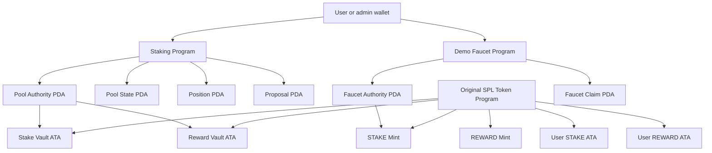
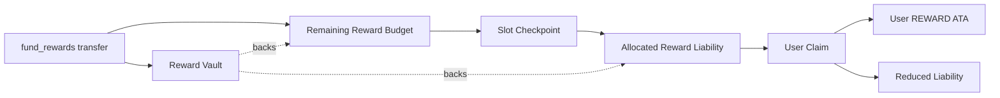

# Slot Staking

Slot Staking is an educational Solana DeFi project that implements a real slot-based staking pool with Rust, Anchor, the original SPL Token Program, a wallet-connected frontend, and a public Devnet deployment.

> This repository is a research and portfolio project. It is not production-ready, has not received an independent professional audit, and must not custody assets with real value.

## Research Question

> How can a Solana staking pool distribute slot-based rewards proportionally without iterating over every staker, while keeping principal and reward obligations solvent?

The project focuses on accumulated reward-per-stake accounting, integer precision, funded reward limits, PDA-controlled token vaults, pause safety, and scoped multisig administration.

## Current Status

Milestones 1 through 25 are complete.

The repository includes:

- Two Anchor programs: the staking pool and a Devnet-only STAKE faucet.
- Integer reward accounting with principal and reward solvency checks.
- PDA-owned vaults, canonical user ATAs, pause safety, emergency withdrawal,
  and scoped `2-of-3` admin proposals.
- A Next.js wallet frontend that prepares canonical user and admin
  transactions.
- Pure Rust tests, LiteSVM invariant tests, frontend tests, a local E2E
  harness, and Devnet smoke evidence.
- A public research article, architecture diagrams, deployment evidence, and
  self-audit.

Key project documents:

- [Research narrative](./docs/RESEARCH.md)
- [Architecture and flow diagrams](./docs/diagrams/README.md)
- [Security self-audit](./AUDIT.md)
- [Devnet evidence](./deployments/DEVNET_EVIDENCE.md)
- [Authoritative specification](./SPEC.md)

Main limitation: this is educational Devnet software, not production software
or an independent professional audit.

The authoritative behavior and acceptance criteria are in [SPEC.md](./SPEC.md).

## Visual Guide

### Account Map



### Reward Solvency



More diagrams are in [docs/diagrams](./docs/diagrams/README.md).

## Architecture

```text
Browser wallet and Next.js frontend
                |
                | Solana transactions and RPC reads
                v
        Anchor Staking Program
          |       |        |
          |       |        +-- Proposal PDAs
          |       +----------- Position PDAs
          +------------------- Pool State PDA
                |
                | CPI with Pool Authority PDA
                v
        Original SPL Token Program
          |                       |
          +-- STAKE Vault ATA     +-- REWARD Vault ATA

        Anchor Demo Faucet Program
                |
                | SPL Token mint_to CPI
                v
        User STAKE ATA + Claim Receipt PDA
```

The Staking Program cannot mint tokens. A separate Devnet-only faucet gives each wallet `1,000 STAKE` once. REWARD has a fixed initial supply and can enter the pool only through voluntary funding transfers.

## Core Behavior

- Users stake STAKE and earn separately funded REWARD.
- Rewards are emitted pool-wide per trusted Solana slot.
- Distribution is proportional and does not loop over every staker.
- Token amounts use six decimals and checked integer arithmetic.
- Reward precision and liabilities use scaled `u128` accounting.
- Empty pools consume no rewards.
- Emissions stop at the funded limit and may end with a partial allocation.
- Users claim independently; fractional rewards carry forward.
- Normal unstaking preserves earned rewards for later claim.
- Emergency withdrawal returns principal and forfeits rewards back to the emission budget.
- Pausing freezes emissions and blocks stake and claim while preserving withdrawal.

## Administration

The pool has three admins and a `2-of-3` approval threshold.

- Any one admin may pause immediately.
- Reward-rate changes, unpause, and admin replacement use on-chain Proposal PDAs.
- Proposal execution is permissionless after two valid approvals.
- Proposal expiry, one-time execution, and `admin_epoch` checks prevent stale administrative authority.
- Admins cannot directly withdraw stake or reward vault assets.

## Solana Accounts

```text
Pool State PDA      shared configuration and accounting
Pool Authority PDA token authority for both vaults
Position PDA        one user's stake and reward state
Proposal PDA        one exact approved admin command
Faucet Claim PDA    one-time Devnet faucet receipt
```

The Stake and Reward Vaults are canonical ATAs owned by the Pool Authority PDA. User deposits and payouts use the user's canonical token ATAs.

## Stack

### Programs

- Rust
- Anchor
- Original SPL Token Program
- LiteSVM
- Solana Devnet

### Frontend

- Next.js 16
- React 19
- TypeScript
- `@solana/kit`
- Wallet Standard
- Tailwind CSS
- Vitest, Testing Library, and Playwright

Package and toolchain versions are documented in the baseline workspace:

- Rust toolchain: `stable` via `rust-toolchain.toml`
- Anchor CLI target: `0.31.1`
- Solana CLI target: `2.1.21`
- Node.js target: `22.18.0`
- npm target: `10.9.3`

The WSL `crypto` environment has the Rust stable toolchain plus the pinned
Anchor and Solana toolchains available. The original Windows workspace still
has a rustup shim temp-file limitation, so WSL is the recommended development
environment.

## Testing

The project uses four levels of evidence:

1. Pure Rust tests for reward arithmetic and invariants
2. LiteSVM tests for compiled programs, PDAs, signers, SPL CPIs, and attacks
3. Local RPC and frontend end-to-end workflows
4. Public Devnet smoke tests with Explorer evidence

Security review happens throughout implementation. Each milestone adds adversarial tests and updates the public self-audit. The final audit will state its limitations and will not claim independent review.

## Planned Repository Layout

```text
programs/staking_pool/   Anchor staking program
programs/demo_faucet/    Devnet-only faucet program
app/                     wallet-connected frontend
tests/                   LiteSVM and local end-to-end tests
scripts/                 setup and Devnet smoke scripts
docs/diagrams/           account and transaction diagrams
docs/RESEARCH.md         portfolio research article
deployments/devnet.json  public deployment evidence
SPEC.md                  authoritative specification
AUDIT.md                 living security self-audit
```

## Development Environment

Anchor development on Windows will use WSL. The storage migration/setup will be handled as a separate preparation task.

The current baseline workflow is:

```bash
cargo fmt-all
cargo lint
cargo test-all
cd app && npm run test
```

Later milestones will add the full Anchor and frontend workflows:

```bash
anchor build
anchor test
npm run build
```

## Local And Devnet Setup

Milestone 19 adds a deployment helper with a safe dry-run path:

```bash
cp scripts/devnet/config.example.json scripts/devnet/config.local.json
scripts/devnet/setup.sh validate
scripts/devnet/setup.sh dry-run
```

For real setup, keep mint keypairs under `.private/`, keep private RPC URLs out
of committed config, and write only public addresses to `deployments/devnet.json`.
The helper creates six-decimal STAKE and REWARD mints, mints the fixed REWARD
supply, revokes REWARD mint authority, initializes the pool, funds rewards
through the staking program, and can be rerun without double-funding the
configured initial amount.

After deploying both programs to Devnet and running setup, Milestone 24 smoke
verification is:

```bash
scripts/devnet/smoke.sh
```

If Devnet SOL runs out after one program deploys, top up the same wallet and
deploy only the missing program, for example:

```bash
anchor deploy -p staking_pool --provider.cluster devnet
```

Recorded public addresses, transaction signatures, smoke output, and Explorer
links are in [DEVNET_EVIDENCE.md](./deployments/DEVNET_EVIDENCE.md). The
blank capture template remains in
[DEVNET_EVIDENCE_TEMPLATE.md](./deployments/DEVNET_EVIDENCE_TEMPLATE.md).

## Local E2E Harness

Milestone 23 adds:

```bash
tests/local-e2e/run.sh
```

This script uses `.private/local-e2e` for fixture keypairs and writes
machine-specific public metadata to `deployments/local-e2e.generated.json`.
It can take a while because it builds Anchor programs, starts a validator,
runs setup, and then runs program plus browser checks.

## Safety Notice

Known trust assumptions include the Devnet program upgrade authority, a single-admin pause capability, `2-of-3` administrative control, a Sybilable test faucet, public RPC availability, and possible Devnet resets. Direct token transfers into vaults are not credited and may become locked surplus.

See [SPEC.md](./SPEC.md) for the complete threat model, formulas, instruction contracts, and acceptance criteria.

## References

- [Solana programs](https://solana.com/docs/core/programs)
- [Solana program deployment](https://solana.com/docs/programs/deploying)
- [Calling the Token Program via CPI](https://solana.com/docs/tokens/advanced/cpi)
- [Anchor documentation](https://www.anchor-lang.com/docs)
- [Anchor LiteSVM testing](https://www.anchor-lang.com/docs/testing/litesvm)
- [Official Next.js + Anchor template](https://solana.com/developers/templates/nextjs-anchor)
