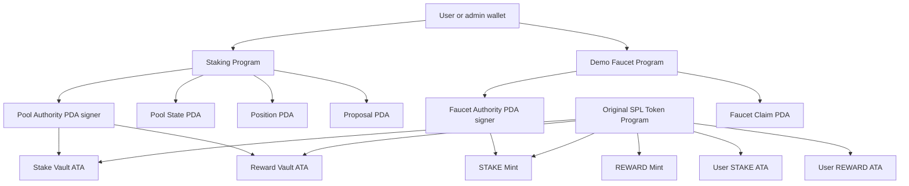
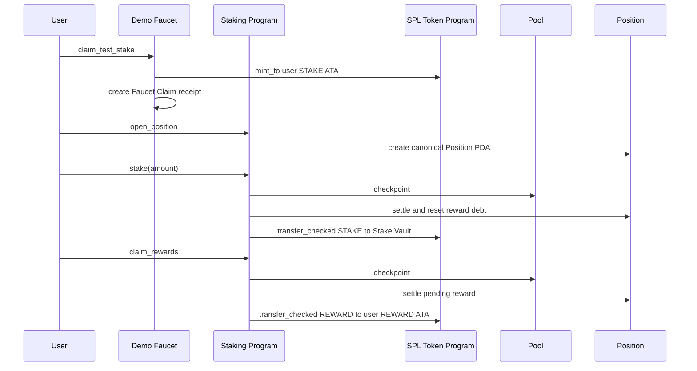
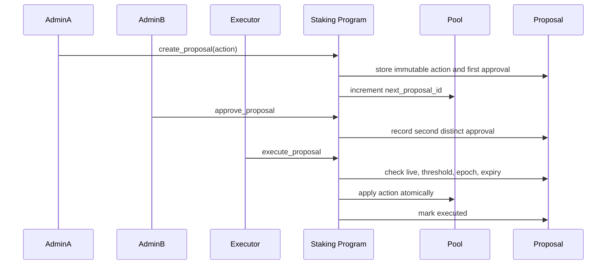
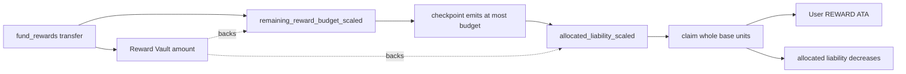

# Diagrams

These Mermaid diagrams summarize the implemented account model and major
state-changing flows.

## Account Map

```mermaid
flowchart TD
  Wallet[User or admin wallet]
  Faucet[Demo Faucet Program]
  Staking[Staking Program]
  Token[Original SPL Token Program]

  Pool[Pool State PDA]
  Position[Position PDA]
  Proposal[Proposal PDA]
  PoolAuthority[Pool Authority PDA signer]
  FaucetAuthority[Faucet Authority PDA signer]
  ClaimReceipt[Faucet Claim PDA]

  StakeMint[STAKE Mint]
  RewardMint[REWARD Mint]
  UserStakeAta[User STAKE ATA]
  UserRewardAta[User REWARD ATA]
  StakeVault[Stake Vault ATA]
  RewardVault[Reward Vault ATA]

  Wallet --> Staking
  Wallet --> Faucet
  Staking --> Pool
  Staking --> Position
  Staking --> Proposal
  Staking --> PoolAuthority
  Faucet --> FaucetAuthority
  Faucet --> ClaimReceipt

  FaucetAuthority --> StakeMint
  PoolAuthority --> StakeVault
  PoolAuthority --> RewardVault

  Token --> StakeMint
  Token --> RewardMint
  Token --> UserStakeAta
  Token --> UserRewardAta
  Token --> StakeVault
  Token --> RewardVault
```

## User Flow

```mermaid
sequenceDiagram
  participant User
  participant Faucet as Demo Faucet
  participant Staking as Staking Program
  participant Token as SPL Token Program
  participant Pool
  participant Position

  User->>Faucet: claim_test_stake
  Faucet->>Token: mint_to user STAKE ATA
  Faucet->>Faucet: create Faucet Claim receipt

  User->>Staking: open_position
  Staking->>Position: create canonical Position PDA

  User->>Staking: stake(amount)
  Staking->>Pool: checkpoint
  Staking->>Position: settle and reset reward debt
  Staking->>Token: transfer_checked STAKE to Stake Vault

  User->>Staking: claim_rewards
  Staking->>Pool: checkpoint
  Staking->>Position: settle pending reward
  Staking->>Token: transfer_checked REWARD to user REWARD ATA
```

## Governance Flow

```mermaid
sequenceDiagram
  participant AdminA
  participant AdminB
  participant Executor
  participant Staking as Staking Program
  participant Pool
  participant Proposal

  AdminA->>Staking: create_proposal(action)
  Staking->>Proposal: store immutable action and first approval
  Staking->>Pool: increment next_proposal_id

  AdminB->>Staking: approve_proposal
  Staking->>Proposal: record second distinct approval

  Executor->>Staking: execute_proposal
  Staking->>Proposal: check live, threshold, epoch, expiry
  Staking->>Pool: apply action atomically
  Staking->>Proposal: mark executed
```

## Reward Solvency

```mermaid
flowchart LR
  Fund[fund_rewards transfer] --> Vault[Reward Vault amount]
  Fund --> Budget[remaining_reward_budget_scaled]
  Budget --> Checkpoint[checkpoint emits at most budget]
  Checkpoint --> Liability[allocated_liability_scaled]
  Liability --> Claim[claim whole base units]
  Claim --> UserReward[User REWARD ATA]
  Claim --> ReducedLiability[allocated liability decreases]

  Vault -. backs .-> Budget
  Vault -. backs .-> Liability
```
